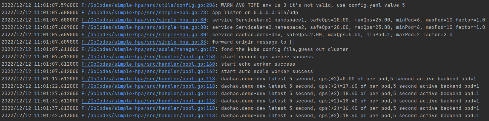

# Auto scale Base Ingress Access Log

## Running Demo



Support `NGINX Ingress`

## Requirement

- `Kubernetes`
- `NGINX Ingress` or `NGINX`

## Quick Start

### 1. Inside Kubernetes

#### Step1 

Change `deploy.yaml`ENV, and then apply it

  ```bash
  # Kubernetes >= 1.12 and <= 1.21 Test Pass
  # if Kubernetes < 1.12,change YAML file apiVersion
  kubectl apply -f deploy.yaml -n default
  ```

#### Step 2

Add  Ingress `ConfigMap`

```bash
 kubectl edit cm/nginx-configuration -n ingress-nginx
 ```
  
Example `ConfigMap`

```yaml
apiVersion: v1
kind: ConfigMap
data:
    # Add for simple-hpa
    disable-access-log: "false"
    access-log-path: "syslog:server=auto-scale.default:514"
    log-format-upstream:  '{"time_str": "$time_iso8601",
                          "time_msec": $msec,
                          "remote_addr": "$proxy_protocol_addr",
                          "x-forward-for": "$http_x_forwarded_for",
                          "request_time": $request_time,
                          "upstream_response_time": "$upstream_response_time",
                          "upstream_addr": "$upstream_addr",
                          "status": $status,
                          "hostname": "$host",
                          "namespace": "$namespace",
                          "service": "$service_name"}'
 ```

The follow field must present
- `namespace`
- `service`
- `time_msec`
- `upstream_addr`
- `status`

### Outside Kubernetes

```bash
docker-compose up -d
```
